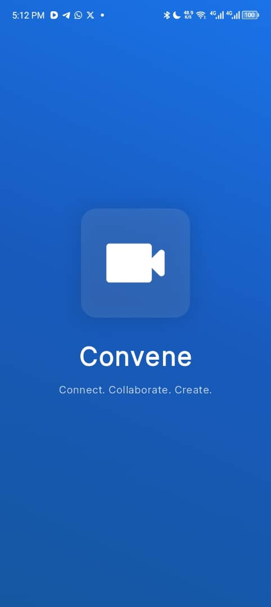
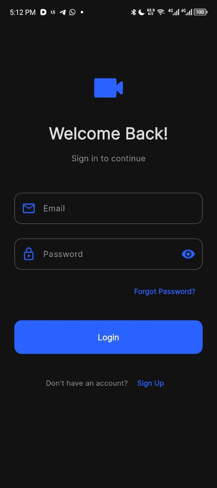
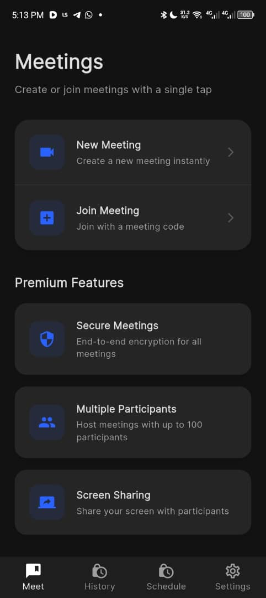
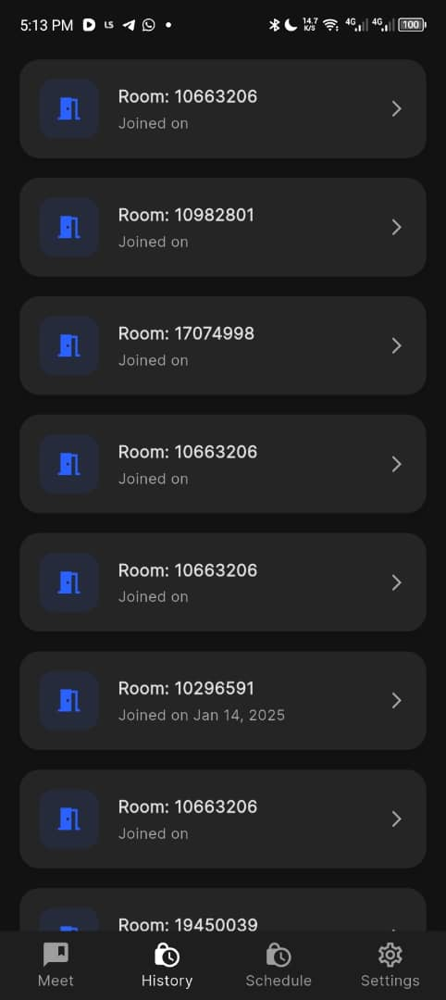
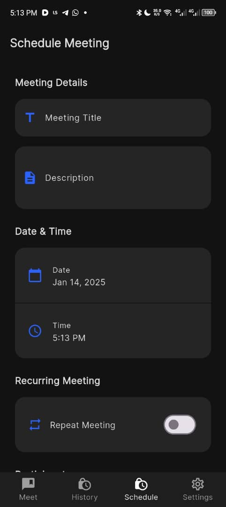

# Convene - Video Conferencing App

  

Convene is a modern video conferencing application that enables seamless virtual meetings, scheduling, and team collaboration. Built with Flutter and Firebase, it provides a robust platform for remote communication.

## 📱 Screenshots

  
  
  
  

## ✨ Features

- **Quick Meetings**
  - Create instant meetings with one tap
  - Join meetings using room codes
  - End-to-end encrypted video calls

- **Meeting Management**
  - Schedule future meetings
  - Send automatic invitations
  - Meeting history tracking
  - Calendar integration

- **Smart Notifications**
  - Meeting reminders
  - Custom notification sounds
  - Vibration patterns
  - Email notifications

- **User Experience**
  - Google Sign-In integration
  - Dark/Light theme
  - Custom accent colors
  - Intuitive UI with animations

## 🛠️ Technical Details

### Built With
- Flutter 3.6.0+
- Firebase Authentication
- Cloud Firestore
- Jitsi Meet SDK

## 🚀 Getting Started

### Prerequisites
- Flutter SDK (3.6.0 or higher)
- Firebase account
- Android Studio / Xcode

## 📱 Supported Platforms
- Android
- iOS

